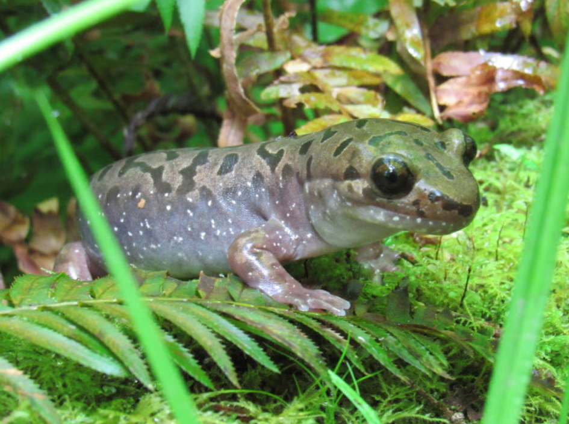
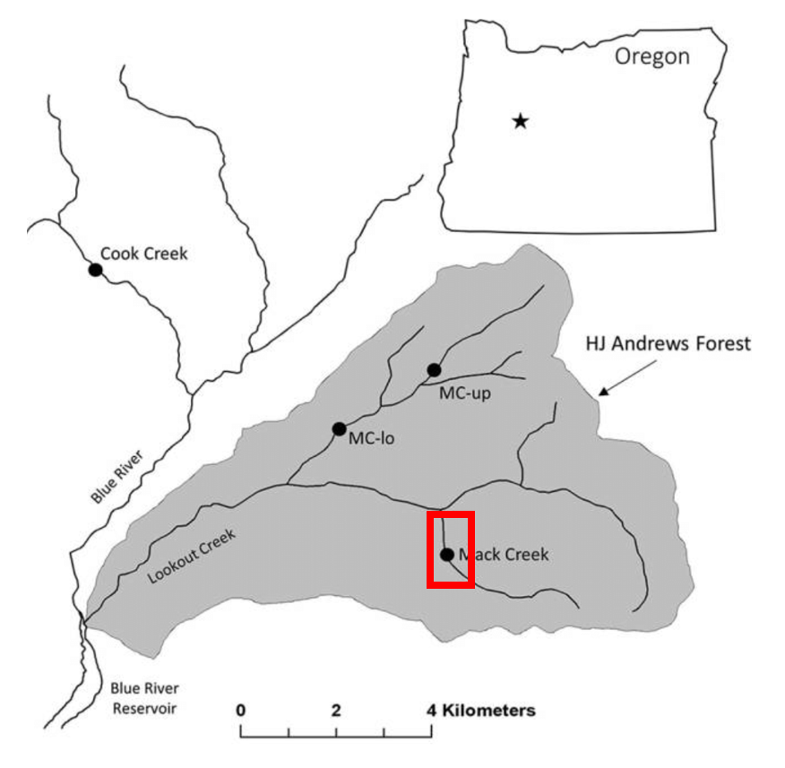
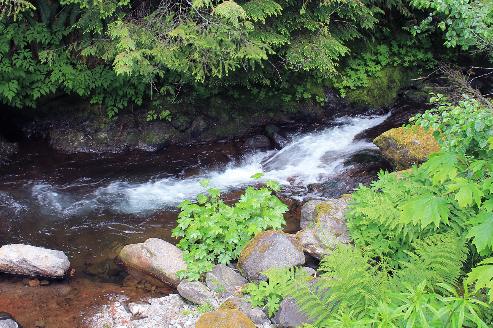

```{r setup, include=FALSE}
knitr::opts_chunk$set(echo = FALSE, message = FALSE, warning = FALSE )
```
### **Introduction**

{width=400px}  
**Figure 1.** *Pacific Giant Salamander (Credit: [Sierra Nystrom](http://natural-history-journal.blogspot.com/2017/06/pacific-giant-salamander-at-prairie.html))*

{width=400px}  
**Figure 2.** *The Mack Creek study site is located in the HJ Andrews Experimental Forest, Oregon. (Credit: [Dana Warren](https://www.researchgate.net/figure/Map-of-study-sites-and-the-HJ-Andrews-Experimental-forest-HJA-Each-dot-represents-a_fig1_314206020))*

{width=450px}  
**Figure 3.** *Mack Creek, HJ Andrews Experimental Forest, OR (Credit: [Oregon State University](https://www.flickr.com/photos/oregonstateuniversity/7468126552/))*

```{r}
library(tidyverse)
library(janitor)
library(here)
library(ggridges)
library(ggbeeswarm)
library(car)
library(kableExtra)
library(effsize)
```
### **Data and Methods**

### **Results**

```{r}

# A. Visually compare annual salamander counts in old growth (OG) and clear cut (CC) sections of Mack Creek

salamander_data <- read_csv("mack_creek_vertebrates.csv") %>% 
  clean_names() %>% 
  mutate(riv_section = case_when(
         section == "OG" ~ "Old Growth",
         section == "CC" ~ "Clear Cut")) %>% 
  mutate(channel_class = (case_when(
            unittype == "C" ~ "Cascade", 
            unittype == "SC" ~ "Side Channel",
            unittype == "P" ~ "Pool"))) 
  

sal_counts <- salamander_data %>% 
  group_by(year, riv_section) %>% 
  summarize(total_count = n()) 
   

ggplot(data = sal_counts, aes(x = year, y = total_count)) +
  geom_line(aes(color = riv_section),
            size = 1) +
  geom_point(size = 1) +
  scale_x_continuous(expand = c(0,0),
                     limits = c(1986.5, 2017.5),
                     breaks = seq(1987, 2017, by = 2)) +
  scale_y_continuous(expand = c(0,0),
                     limits = c(100, 800),
                     breaks = seq(100, 800, by = 100)) +
  theme_minimal() +
  labs(title = "Pacific Giant Salamander Counts",
       subtitle = "Mack Creek, OR (1987-2017)",
       x = "Year",
       y = "Salamander Count") +
  theme(axis.text.x = element_text(angle= 90, 
                                   hjust = 1),
        legend.title = element_blank()) 

            
```


```{r}
# B. Table of 2017 salamander counts by channel classification (pool, cascades and side-channel) in old growth (OG) and clear cut (CC) sections of Mack Creek.  

sal_count_2017 <- salamander_data %>% 
  filter(year == "2017") %>% 
  filter(unittype %in% c("P", "C", "SC")) %>% 
  count(riv_section, channel_class)

# Put it into wide format (contingency table):
sal_count_table <- sal_count_2017 %>% 
  pivot_wider(names_from = riv_section, values_from = n)

# Make table with proportions
sal_count_props <- sal_count_table %>% 
  janitor::adorn_percentages(denominator = "row") %>% 
  adorn_pct_formatting(digits = 0) %>% 
  adorn_ns(position = "front") %>% 
  rename("Channel Class" = channel_class) 

# Put in nice formatted table
kable(sal_count_props) %>% 
  kable_styling()


```


```{r}
# C.Using the 2017 counts found in Results B above, answer: is there a significant difference in where in the channel Pacific giant salamanders are located (pool, cascade or side channel) between the two sections (old growth and clear cut)?

chi_sal_counts <- sal_count_table %>% 
  select(-channel_class)

sal_counts_chi <- chisq.test(chi_sal_counts)

sal_counts_chi
```

There IS a significant effect of forest condition (old growth/clear cut) on where in the channel salamanders are found (pool/side-channel/cascade) for salamanders sampled in 2017. ($\chi$^2^(`r sal_counts_chi$parameter`) = `r round(sal_counts_chi$statistic,2)`, *p* = `r round(sal_counts_chi$p.value, 3)`).

```{r}
# D. Compare weights of Pacific giant salamanders in clear cut and old growth forest sections of the creek in 2017.

sal_weights_cc <- salamander_data %>% 
  filter(year == "2017", section == "CC") 

sal_weights_og <- salamander_data %>%   
  filter(year == "2017", section == "OG") 

# mean weights
mean_weights_cc <- mean(sal_weights_cc$weight, na.rm = TRUE)
mean_weights_og <- mean(sal_weights_og$weight, na.rm = TRUE)

# weights standard deviation
sd_weights_cc <- sd(sal_weights_cc$weight, na.rm = TRUE)
sd_weights_og <- sd(sal_weights_og$weight, na.rm = TRUE)

# sample size
n_2017_cc <- sum(!is.na(sal_weights_cc$weight))
n_2017_og <- sum(!is.na(sal_weights_og$weight))

# t-test
weight_ttest_og <- sal_weights_og %>% 
  pull(weight)

weight_ttest_cc <- sal_weights_cc %>% 
  pull(weight)

sal_weight_ttest <- t.test(weight_ttest_og, weight_ttest_cc)
sal_weight_ttest 

# Cohen's d

sal_weight_d <- cohen.d(weight_ttest_cc, weight_ttest_og, na.rm = TRUE)
sal_weight_d
```

Mean Pacific Giant Salamander size in the clear cut section of Mack Creek in 2017 (`r round(mean_weights_cc, 2)` $\pm$ `r round(sd_weights_cc, 2)`, n = `r n_2017_cc`) differed significantly from mean Pacific Giant Salamander size in the old growth section of Mack Creek in 2017 (`r round(mean_weights_og, 2)` $\pm$ `r round(sd_weights_og, 2)`, n = `r n_2017_og`) by a two-sided, two sample t-test (t(`r round(sal_weight_ttest$parameter, 2)`) = `r round(sal_weight_ttest$statistic, 2)`, *p* < 0.001. Although there is a stastitical difference in mean size among salamanders in different forest conditions, the effect size is negligible (Cohen's *d* = `r round(sal_weight_d$estimate, 2)`). 


```{r}
# E. Visually compare Pacific giant salamander weights between the three channel classifications. You can choose how to best visualize the weights between the three groups

sal_weights_class <- salamander_data %>% 
  filter(year == "2017") %>% 
  filter(unittype %in% c("C", "P", "SC")) 

ggplot(data = sal_weights_class, aes(x = weight)) +
  geom_histogram() +
  facet_wrap(~channel_class)

ggplot(data = sal_weights_class, aes(sample = weight)) +
  geom_qq() +
  facet_wrap(~channel_class) 

leveneTest(weight ~ channel_class, data = sal_weights_class)
```

Does not satisfy assumptions for ANOVA test?

### **Summary**

### **References**
**Gregory S. V. 2016.** Aquatic Vertebrate Population Study in Mack Creek, Andrews Experimental Forest, 1987 to present. Environmental Data Initiative. https://doi.org/10.6073/pasta/5de64af9c11579266ef20da2ff32f702. Dataset accessed 11/27/2019.
